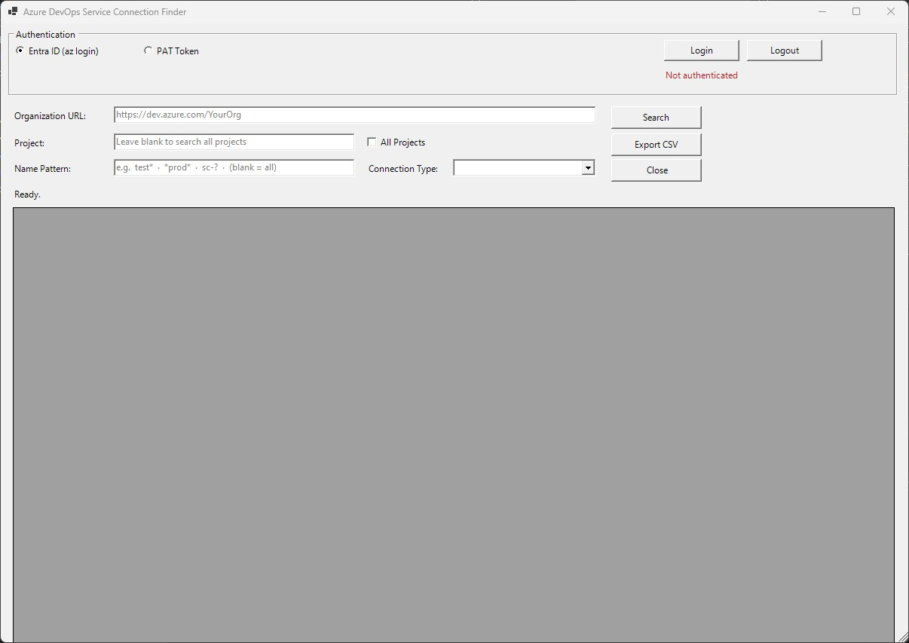

# Azure DevOps Service Connection Finder

---

## Overview

Two PowerShell scripts that let you search, filter, and export Azure DevOps service connections across one or all projects in an organisation. Both scripts share the same feature set:

| Feature | CLI | GUI |
|---|---|---|
| Entra ID (az login) authentication | ✅ | ✅ |
| PAT token authentication | ✅ | ✅ |
| Filter by organisation | ✅ | ✅ |
| Filter by project / all projects | ✅ | ✅ |
| Wildcard name filter | ✅ | ✅ |
| Filter by connection type | ✅ | ✅ |
| Export results to CSV | ✅ | ✅ |
| Direct Azure DevOps links | ✅ | ✅ |
| Interactive prompts when no args | ✅ | — |
| Windows Forms UI | — | ✅ |

---

## Requirements

- PowerShell 5.1 or later
- [Azure CLI](https://learn.microsoft.com/cli/azure/install-azure-cli) with the **azure-devops** extension  
  *(the scripts install the extension automatically if it is missing)*

---

## Scripts

### `Find-ServiceConnection.ps1` — CLI version

A terminal script. Run it with parameters or without arguments to enter interactive mode.

**Syntax**

```powershell
.\Find-ServiceConnection.ps1 -OrgUrl <url> [options]
```

**Parameters**

| Parameter | Required | Description |
|---|---|---|
| `-OrgUrl` | Yes* | Organisation URL, e.g. `https://dev.azure.com/MyOrg`. Falls back to `AZDO_ORG_SERVICE_URL` env var. |
| `-Project` | No | Project name. Omit to search all projects. |
| `-Name` | No | Name filter with wildcard support. Default: `*` (all). |
| `-ConnectionType` | No | Filter by type: `azurerm`, `github`, `kubernetes`, `dockerregistry`, `externaltfs`, `git`. |
| `-AuthType` | No | `EntraID` (default) or `PAT`. |
| `-PatToken` | No | PAT token for PAT auth. Falls back to `AZURE_DEVOPS_EXT_PAT` env var. |
| `-ExportCsv` | No | File path to save results as CSV, e.g. `results.csv`. |

\* *If `-OrgUrl` is omitted and the env var is not set, the script enters **interactive mode** and prompts for all values.*

**Examples**

```powershell
# Interactive mode — prompts for everything
.\Find-ServiceConnection.ps1

# Search all connections in an org (Entra ID login)
.\Find-ServiceConnection.ps1 -OrgUrl https://dev.azure.com/MyOrg

# Filter by name wildcard in a specific project
.\Find-ServiceConnection.ps1 -OrgUrl https://dev.azure.com/MyOrg -Project MyProject -Name "prod-*"

# Filter by connection type across all projects
.\Find-ServiceConnection.ps1 -OrgUrl https://dev.azure.com/MyOrg -ConnectionType azurerm

# Authenticate with a PAT token
.\Find-ServiceConnection.ps1 -OrgUrl https://dev.azure.com/MyOrg -AuthType PAT -PatToken "mytoken..."

# Export results to CSV
.\Find-ServiceConnection.ps1 -OrgUrl https://dev.azure.com/MyOrg -Name "prod-*" -ExportCsv results.csv

# Use environment variable for org URL
$env:AZDO_ORG_SERVICE_URL = 'https://dev.azure.com/MyOrg'
.\Find-ServiceConnection.ps1 -Name "prod-*"
```

**Wildcard reference**

| Pattern | Matches |
|---|---|
| `test*` | Anything starting with `test` |
| `*prod*` | Anything containing `prod` |
| `sc-?` | `sc-` followed by exactly one character |
| `*` | Everything (default) |

---

### `Find-ServiceConnection.GUI.ps1` — GUI version

A Windows Forms application. Run without any arguments — all input is done through the UI.

```powershell
.\Find-ServiceConnection.GUI.ps1
```

**UI walkthrough**

1. **Authentication** — choose *Entra ID (az login)* or *PAT Token*, then click **Login**.
2. **Organisation URL** — enter your Azure DevOps organisation URL (e.g. `https://dev.azure.com/MyOrg`).
3. **Project** — enter a project name, or tick **All Projects** to search the entire organisation.
4. **Name Pattern** — wildcard filter (hover for examples). Leave blank to match all.
5. **Connection Type** — optional dropdown filter by endpoint type.
6. Click **Search**. Results appear in the grid.
7. **Double-click** any row to open that service connection directly in Azure DevOps.
8. Click **Export CSV** to save the current results to a file.

---

## Output fields

Both scripts return the same fields:

| Field | Description |
|---|---|
| `Project` | Azure DevOps project name |
| `Name` | Service connection name |
| `Id` | Service connection GUID |
| `Type` | Endpoint type (e.g. `azurerm`) |
| `Url` | Target URL of the connection |
| `CreatedBy` | Display name of the creator |
| `IsShared` | Whether the connection is shared across projects |
| `IsReady` | Whether the connection is in a ready state |
| `DevOpsUrl` | Direct link to the connection in Azure DevOps settings |

---

## Authentication

### Entra ID (recommended)

The scripts call `az login --use-device-code`. Follow the on-screen instructions to sign in with your browser.

### PAT Token

Generate a PAT in Azure DevOps with at least the **Service Connections (Read)** scope, then either:

- Pass it via `-PatToken "your-token"` (CLI), or enter it in the PAT field (GUI)
- Set the environment variable before running:

```powershell
$env:AZURE_DEVOPS_EXT_PAT = 'your-token'
```

---

## License

MIT License — Copyright (c) 2026 Magomedbashir Kushtov ([github.com/gearup2000](https://github.com/gearup2000))

Free to use, copy, modify, and distribute with no restrictions, provided the copyright notice is retained.
